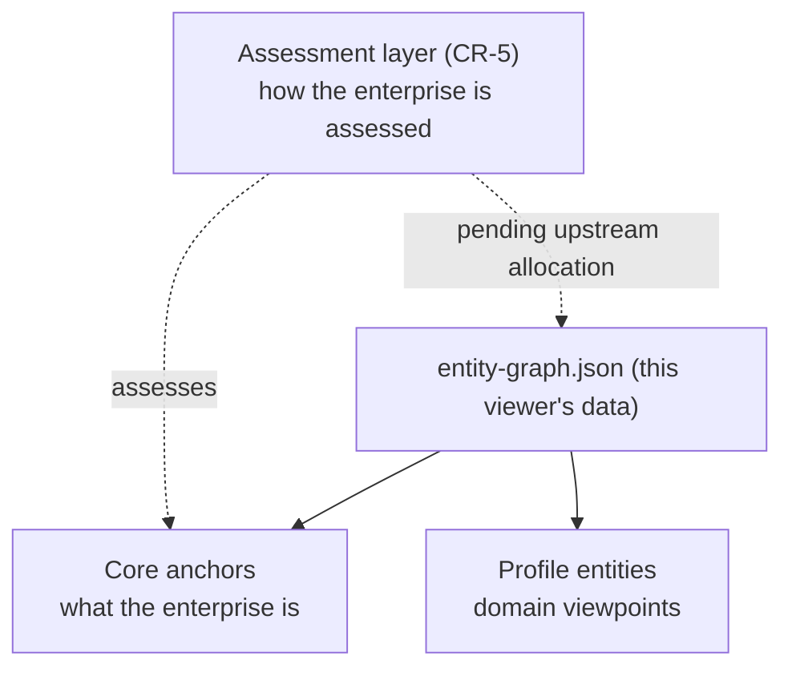

# dea-web-viewer

Interactive web viewer for the [TechNeHub Labs](https://github.com/technehub-labs) DEA
(Digital Enterprise Architecture) Metamodel. Renders the canonical metamodel as a
clickable, filterable, multi-view canvas.

**Live site:** <https://technehub-labs.github.io/dea-web-viewer/>

## Relationship to the classic metamodel navigator

This is a **separate tool** from the classic class-grid navigator at
<https://technehub-labs.github.io/metamodel/>. The two UIs share the
same published artefacts (entity-graph.json + metamodel.svg from
`technehub-labs/technehub-labs.github.io/metamodel/`) but render them
independently:

| Tool | URL | Tech | Use case |
|---|---|---|---|
| **dea-web-viewer** (this repo) | `/dea-web-viewer/` | React 19 + Vite + TS, 5 view modes | Deep exploration: SVG topology, interactive canvas, matrix, traceability, catalog browser |
| **Classic navigator** | `/metamodel/` | Vanilla JS class-grid | Quick reference: rendered SVG with click-to-catalog-repo navigation |

The classic navigator remains the visual-refinement work from
`dea-metamodel` PR #66. It is not a redirect target.

## What it is

A React 19 + Vite + TypeScript single-page app with five modes:

| Mode | Purpose |
| --- | --- |
| **Canonical SVG** | The bot-rendered `metamodel.svg` from `dea-metamodel`, with click + hover binding on `id="elem_<ALIAS>"` markers |
| **Interactive** | Hand-routed SVG topology — layer-aware layout, entity search, impact tracing (BFS upstream + downstream) |
| **Matrix** | Entity × relationship grid view |
| **Traceability** | Path finder between any two entities via BFS shortest path |
| **Catalogs** | Card grid of every entity in the synced graph, filterable by layer and status, with one-click link to its catalog repo |
| **Maturity radar** (experimental, default off) | Dual-band v1+v2 maturity score radar — renders the canonical v2 maturity scoring bands (CR-014) overlayed on the legacy v1 linear bands, with the CR-014 worked-example score (80) → effort-adjusted value 49.2 visible. Consumer for `dea-cli maturity score` (CR-MM-02). Gated behind `dea.experimental.maturityV2` feature flag — see [`src/lib/feature-flags.ts`](src/lib/feature-flags.ts). |

## View modes (maturity radar — feature flag)

The 6th mode (`maturity-radar`) is **experimental and off by default**. To preview
locally:

```bash
# Toggle the flag in the browser devtools console (the radar tab then appears in the nav)
# setExperimentalFlag('maturityV2', true)
```

Or via environment variable at build time:

```bash
VITE_MATURITY_V2=1 npm run dev
```

Source of truth: `technehub-labs/dea-metamodel/assessment-models/maturity/`
(CR-014 / CR-MM-01 / CR-MM-01.1). The `MaturityRadar` component fetches the YAML
via `loadMaturityData()` (which `asserts drift` against the inlined `V2_BANDS`
canonical literal — drift falls back to the canonical). Until the
`sync-maturity-from-dea-metamodel.yml` workflow lands a vendored copy at
`public/data/maturity/`, the radar uses the inlined canonicals only.


## Source of truth

This viewer **does not** hand-author metamodel data. All entities, relationships,
layer assignments, and the rendered SVG are pulled from
[`technehub-labs/technehub-labs.github.io`](https://github.com/technehub-labs/technehub-labs.github.io)
(the **publication point** of the metamodel viewer) by a CI workflow and
committed under `public/data/`:

```
public/data/entity-graph.json   # entities, classes, catalog linkage
public/data/metamodel.svg       # canonical PlantUML render
public/data/metamodel.puml      # optional — only if upstream publishes it
```

The sync source is the Pages repo (not `dea-metamodel` directly)
because the Pages repo is what users actually see at
`https://technehub-labs.github.io/metamodel/` and is publicly fetchable
from CI without any PAT secret.

These files are **owned by the bot** — see [`.github/workflows/sync-from-dea-metamodel.yml`](.github/workflows/sync-from-dea-metamodel.yml).
Hand-edits will be overwritten on the next sync (the workflow detects the drift
and emits a `::warning::` annotation).

To change the metamodel, edit it in `dea-metamodel`, run its regeneration bot
to publish the new artefacts to `technehub-labs.github.io@main`, then trigger the
sync:

```bash
gh workflow run sync-from-dea-metamodel.yml --repo technehub-labs/dea-web-viewer
```

## The semantics being rendered

The graph this viewer displays is governed by the CR programme in
[`dea-metamodel/change-requests/`](https://github.com/technehub-labs/dea-metamodel/tree/main/change-requests).
Viewer-relevant semantics, in order:

- **CR-1/2/3** — one normative model; typed, directed relationships; no relationship
  state on entities. This is why the Interactive/Traceability modes can trust the
  graph topology.
- **CR-4 (v0.9.0)** — every entity carries `membership: core | profile/<id>`. The
  18-anchor OpenDEA Core is the stable semantic skeleton; the 10 profiles (business,
  digital, data, technology, ai, ecosystem, governance, assessment, dmm, ecf) are
  specialized viewpoints that extend it. Core/Profile rendering modes are a planned
  consumer of this field.
- **CR-5 (v0.10.0)** — assessment is a *separate semantic layer* over the architecture
  graph: `Assessment → Result → (Score | MaturityLevel) + Evidence + Confidence`, with
  `AssessmentGap ──addressed-by──> Change`. Maturity is never an intrinsic entity
  property (CI rule A008). DMMv5 plugs in as a profile whose dimensions `assess` DEA
  entities. The **assessment overlay / maturity heatmap** view (CR-5 §39 Phase 9) will
  render this layer once the 28 assessment entities are allocated into the upstream
  OpenDEAM root model and flow into `entity-graph.json`.
- **CR-6 (v0.11.0)** — architecture is a *time-dependent state*, not a static catalogue.
  Five clocks (transaction/valid/observation/planned/effective), per-type lifecycles and
  audit events, Baseline/Current/Target/Transition/Scenario states, snapshots, derived
  deltas, version chains. Relationships carry temporal validity — a *planned* edge must
  never render as a current edge (T004). The **timeline, state selector, baseline↔target
  comparison and delta visualization** (CR-6 §42 Phase 9) consume this layer once the 18
  lifecycle entities are allocated upstream.
- **CR-7 (v0.12.0)** — the causal/governance layer: Intent → Objective → Policy → Decision →
  Action → Change → Outcome → Evidence → reassessment. Agents are enterprise Actors with
  explicit authority, policy boundaries, autonomy levels and human oversight — *participants
  in the semantic system, not its center*. Key viewer-relevant distinctions: planned vs
  actual edges, permitted vs prohibited agent actions, approval gates as first-class nodes.
  The 32 governance/agentic entities await upstream allocation like the CR-5/CR-6 layers.
- **CR-8 (v1.0.0)** — the consolidation into a formal specification. **The viewer is now
  explicitly a consumer, never a definer** (CR-8 §47-§48, §67): dependency direction is
  specification → schema → validator → reference models → viewer. Presentation hints
  (icons, groups, colors, planned-vs-current edge styles, state overlays) live in
  `dea-metamodel/visualization/profile/` so future consumers (CLI, IDE, graph DB, BI, AI
  agents) need no semantic changes. Golden and negative reference models
  (`dea-metamodel/models/`) are the canonical fixtures any consumer can test against.



## Sync schedule

The bot runs:

- **Every 6 hours** via `cron: '0 */6 * * *'`
- **On `workflow_dispatch`** with an optional `ref` input (defaults to `main`)
- **On push to `public/data/*`** — fails the build to flag hand-edits as drift

## Local development

```bash
npm install
npm run dev       # vite dev server on http://localhost:3000
npm run lint      # tsc --noEmit (type check)
npm run build     # vite build → dist/
```

> The viewer requires `public/data/{entity-graph.json,metamodel.svg,metamodel.puml}`
> to exist. If you cloned a fresh copy and these are missing, run the sync
> workflow or copy them from the latest CI run.

## Architecture

```
src/
├── App.tsx                       # top-level state, view routing, error/loading UI
├── components/
│   ├── Header.tsx                # toolbar (view switch, search, export, version)
│   ├── LayerFilterBar.tsx        # per-layer toggle chips with entity counts
│   ├── InteractiveCanvas.tsx     # hand-routed SVG topology (1207 lines)
│   ├── CanonicalSvgView.tsx      # embeds synced SVG, wires elem_* click/hover
│   ├── MetamodelMatrix.tsx       # entity × relationship grid
│   ├── TraceabilityPathFinder.tsx# BFS shortest path between two entities
│   ├── CatalogBrowser.tsx        # card grid filterable by layer/status
│   └── EntityDrawer.tsx          # side-panel with selected entity detail
├── data/
│   ├── syncedMetamodel.ts        # runtime loader + PUML parser + AST builder
│   └── metamodelData.ts          # legacy re-export shim (kept for back-compat)
├── types.ts                      # shared TS interfaces
├── utils/                        # (reserved; no current utils)
└── main.tsx                      # React root
```

The runtime contract:

1. On mount, `App.tsx` calls `loadSyncedArtefacts()` which fetches all three files in parallel
2. `buildMetamodelAst()` parses the PUML for attributes and relationships, layers come from the graph
3. Components consume the resulting `MetamodelAST` — they never see the wire format
4. If the synced files are missing or invalid, the app surfaces an actionable error with the gh CLI command to fix it

## CI

| Workflow | Trigger | Purpose |
| --- | --- | --- |
| `sync-from-dea-metamodel.yml` | cron (6h), `workflow_dispatch`, push to `public/data/*` | Pull canonical artefacts from `dea-metamodel` and commit |
| `ci.yml` | push to `main`, pull request | `npm ci` + type check + build to catch regressions |
| `deploy-pages.yml` | push to `main`, after `ci.yml` succeeds | Build `dist/` and deploy to GitHub Pages |

## License

Apache License 2.0. See [LICENSE](LICENSE) and [NOTICE](NOTICE).

```
TechNeHub Labs — dea-web-viewer
Copyright 2026 TechNeHub Labs
```